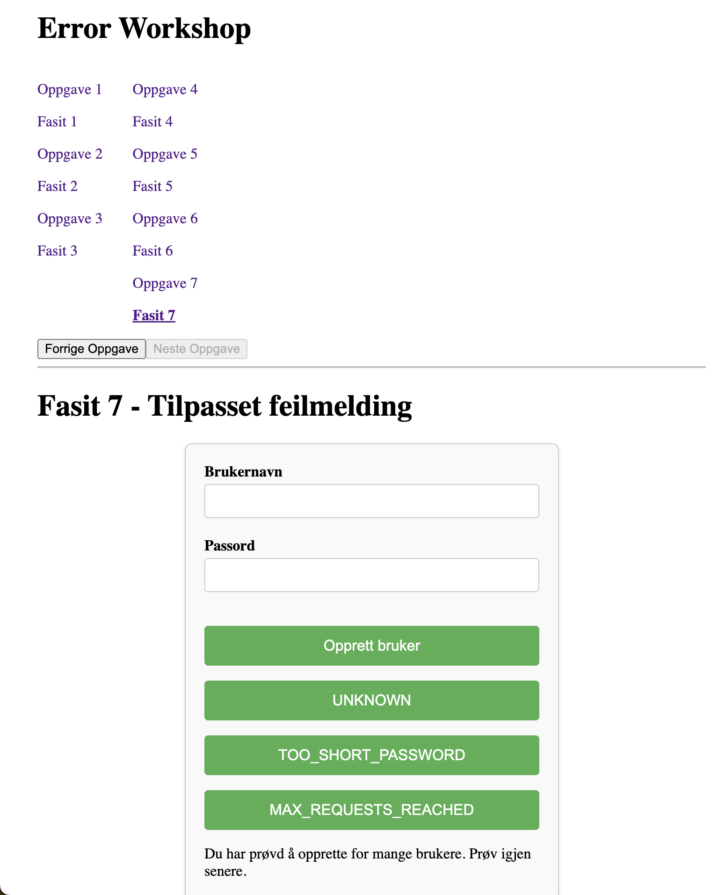

# Feilhåndterings- Workshop



Workshop for å lære feilhåndtering i React. Du finner oppgavene i `src/oppgaver`.

Du leser oppgave1 i `Oppgave01.tsx`, og ser fasit i `Fasit01.tsx`, og så videre.

# Setup

Node version (see .nvmrc):

```
nvm use
```

Install

```
npm install
```

# App run

Run client and server: (port 3000 and 8000)

```
npm run dev
```
